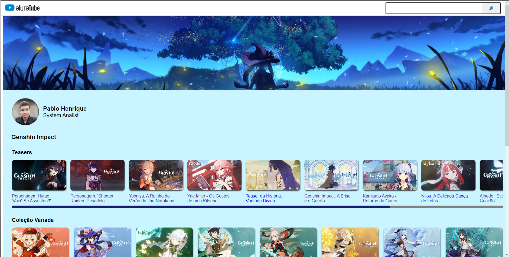

## AluraTubeReact
Projeto REACT desenvolvido na Imersão-Alura

<h1 align="center">Imersão React - Alurakut</h1>

A Imersão React é gratuita e é voltada para profissionais, estudantes e para todo
mundo. É uma semana de <strong>aulas intensas de Devs para Devs</strong>, aulas completas para a criação dos projetos a
partir do zero, com suporte da comunidade, lives e discussões aprofundadas de tecnologia.
Nesta imersão vamos focar nas tecnologias atuais e <strong>aprender mais sobre front-end!</strong>

<h4 align="center"><a href="https://aluratube-react-lac.vercel.app">Clique aqui para ver meu projeto final!</a></h4>

## Preview

## Linguagens e tecnologias utilizadas

        

## Funcionalidades da pagina
  - Visualizar videos cadastrados, 
  - Pesquisar e adicionar os videos, 
  - Tema Light/Dark.

## Instalação

    - Clonar repositorio
    $ git clone https://github.com/PabloHenrique/AluraTubeReact.git

    - Instalar dependencias
    $ npm install

    - Rodar aplicativo
    $ npm run dev
    
<a href="styled-components.md">Example: App with styled-components</a>

## Instrutores

- <a href="https://twitter.com/omariosouto">@Mario Souto</a>  
- <a href="https://twitter.com/juunegreiros">@Nayanne Lopes</a>  
- <a href="https://twitter.com/paulo_caelum">@Paulo Silveira</a>  

## 📂 Referencias
  

    
Links citados nas Aulas

      - <a href="https://nodejs.org/en/">
      Preparando o ambiente - Node.Js</a> 
      - <a href="https://m3.material.io/components">
      Material Design</a>  
      - <a href="https://pt-br.reactjs.org">
      Documentação React</a>  
      - <a href="https://nextjs.org">
      Documentação Next.Js</a>  
      - <a href="https://styled-components.com">
      Documentação do Styled Components</a>  
      - <a href="https://github.com/vercel">
      Vercel on Github</a>  
      - <a href="https://www.figma.com/file/1acrju7CLwHkSh6e7xEk9h/Aluratube?node-id=5%3A2">
      Projeto Figma</a>  
  

  

    
Material Complementar

    - <a href="https://pt-br.reactjs.org/docs/react-component.html#setstate">
      React: SetState</a> 
      - <a href="https://techguide.sh/pt-BR/path/react/react-components/">
      Techguide: React - Components</a> 
      - <a href="https://reactjs.org/docs/lists-and-keys.html">
      React: Lists and Keys</a> 
      - <a href="https://www.youtube.com/watch?v=HGrXz6vHngI">
      Efeito Stagger com React e Styled Components</a> 
  

